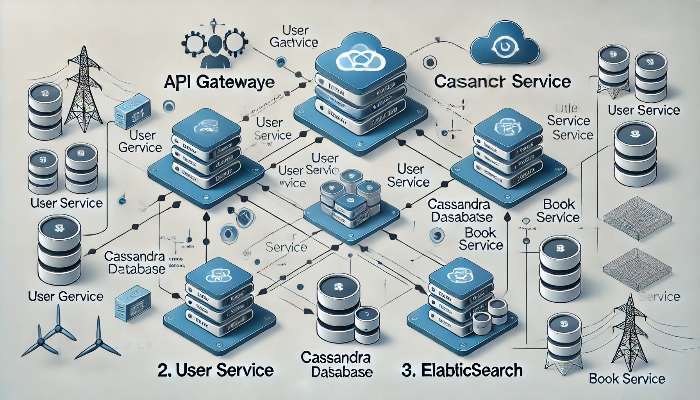

# BookStore Microservices Architecture

This repository contains the architecture and implementation of a BookStore application built using a microservices approach. The application consists of three main services: API Gateway, User Service, and Book Service, along with supporting services like Cassandra and Elasticsearch.

## Architecture Overview



### Components

1. **API Gateway**
   - **Purpose**: Acts as a single entry point for all client requests. It routes requests to the appropriate microservices.
   - **Port**: Exposes port `8080`.
   - **Dependencies**: Depends on both the User Service and Book Service.

2. **User Service**
   - **Purpose**: Manages user-related operations, including registration, authentication, and user profile management.
   - **Port**: Exposes port `8081`.

3. **Book Service**
   - **Purpose**: Handles operations related to books, such as creating, updating, deleting, and retrieving book information.
   - **Port**: Exposes port `8082`.
   - **Dependencies**: Depends on Cassandra for data storage and Elasticsearch for searching capabilities.

4. **Cassandra**
   - **Purpose**: Serves as the primary database for storing book information.
   - **Image**: Uses the official `cassandra` Docker image.
   - **Port**: Exposes port `9042`.
   - **Configuration**:
     - Cluster Name: `BookStoreCluster`
     - Data Center: `dc1`
     - Replication Factor: `1`

5. **Elasticsearch**
   - **Purpose**: Provides search capabilities for the Book Service.
   - **Image**: Uses the official `elasticsearch` Docker image.
   - **Port**: Exposes port `9200`.
   - **Configuration**:
     - Discovery Type: `single-node`
     - Elastic Password: (set to a secure password)

### Networking

All services are connected through a Docker network named `microservices-network`. This allows them to communicate with each other using their service names as hostnames.

## Getting Started

### Prerequisites

- Docker and Docker Compose installed on your machine.
- Basic knowledge of Go programming language.

### Installation

1. Clone the repository:

   ```bash
   git clone https://github.com/NHadi/GoBookStore.git
   cd GoBookStore
   ```

2. Build and run the services using Docker Compose:

   ```bash
   docker-compose up --build
   ```

3. Access the services:
   - API Gateway: `http://localhost:8080`
   - User Service: `http://localhost:8081`
   - Book Service: `http://localhost:8082`
   - Cassandra: Connect using a CQL client to `cassandra:9042`.
   - Elasticsearch: Access at `http://localhost:9200`.

### API Endpoints

The Book Service exposes the following endpoints:

- **Create Book**: `POST /books`
- **Get Books**: `GET /books`
- **Update Book**: `PUT /books/{id}`
- **Delete Book**: `DELETE /books/{id}`
- **Borrow Book**: `POST /books/borrow/{userId}/{bookId}`

You can explore these endpoints using tools like [Postman](https://www.postman.com/) or [Swagger](http://swagger.io/).

### Health Check

To check the health of the Book Service, access:

```
GET /health
```

This endpoint returns a simple "Healthy" message if the service is running correctly.

## Contributing

Contributions are welcome! If you have suggestions for improvements or find bugs, feel free to create an issue or submit a pull request.

## License

This project is licensed under the MIT License - see the [LICENSE](LICENSE) file for details.

## Acknowledgements

- [Gorilla Mux](https://github.com/gorilla/mux) for routing in Go.
- [Swagger](https://swagger.io/) for API documentation.
- [Cassandra](http://cassandra.apache.org/) for data storage.
- [Elasticsearch](https://www.elastic.co/) for search functionality.

## Contact

For support or inquiries, please contact:

- **Name**: Nurul Hadi
- **Email**: nurul.hadi@outlook.com
